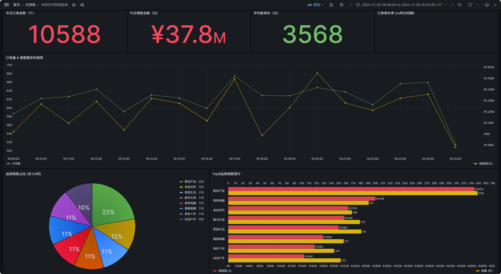
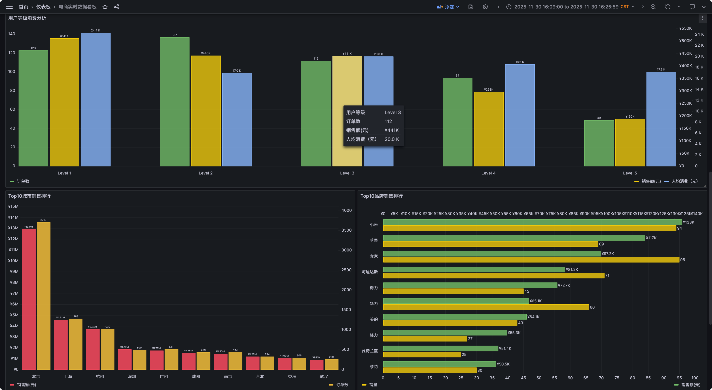
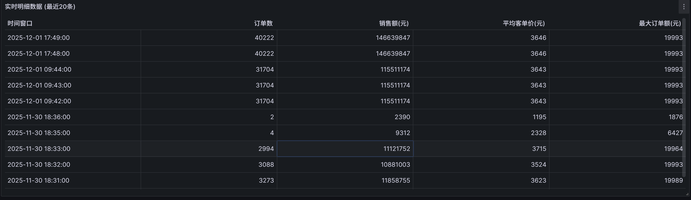
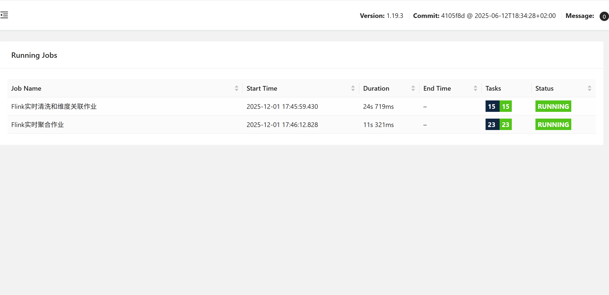
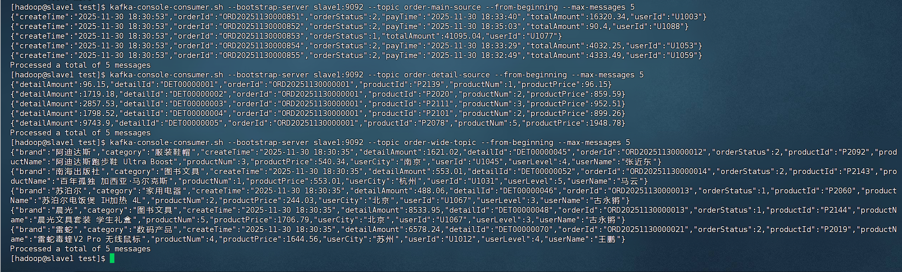
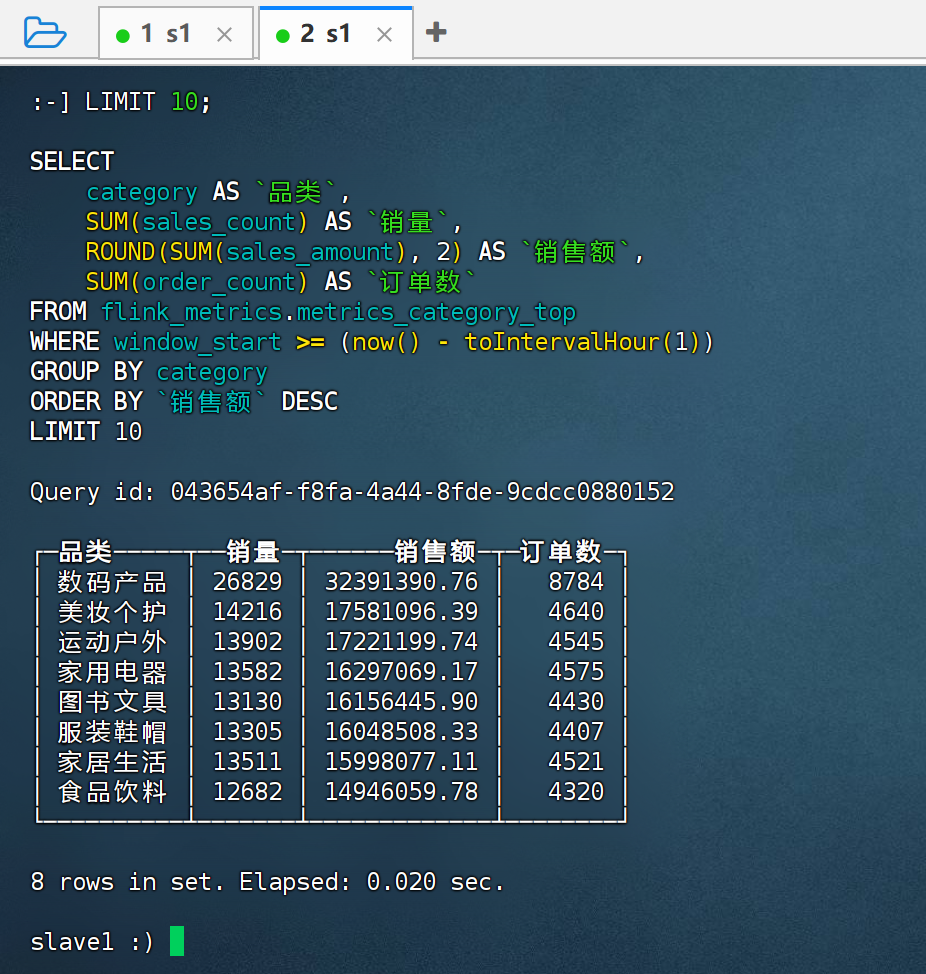
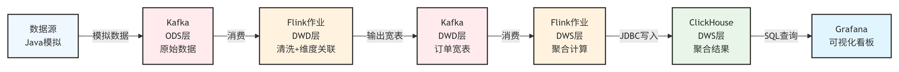

# 基于Flink的商业智能实时数仓决策平台

## 项目概述

本项目实现了一个完整的实时数据仓库系统，包含数据生成、实时清洗、维度关联、指标聚合和可视化展示等全流程。

## 效果展示

### Grafana 监控大屏







### Flink Web UI 作业运行


### Kafka 监控 Topic 列表


### ClickHouse 数据查询

#### 时间窗口指标


#### 分类 Top8


### 技术架构

项目采用经典的 Lambda 架构理念，构建了一个完整的实时数据处理链路。




## 系统架构图

```
┌─────────────────────────────────────────────────────────────────────────────────────────────────────────┐
│                                    基于Flink的商业智能实时数仓决策平台                                      │
└─────────────────────────────────────────────────────────────────────────────────────────────────────────┘

┌─────────────────┐     ┌─────────────────────────────────────────────────────────────────────────────────┐
│   数据源层 ODS   │     │                              实时计算层                                          │
│                 │     │  ┌─────────────────────────────────────────────────────────────────────────┐   │
│ ┌─────────────┐ │     │  │                    Flink 清洗作业 (flink-cleansing)                      │   │
│ │ Java 数据   │ │     │  │  ┌──────────┐   ┌──────────┐   ┌──────────┐   ┌──────────────────────┐  │   │
│ │ 生成器      │─┼──┐  │  │  │ 数据去重  │ → │ 数据清洗  │ → │ 双流Join │ → │ 异步维度关联(MySQL) │  │   │
│ │             │ │  │  │  │  └──────────┘   └──────────┘   └──────────┘   └──────────────────────┘  │   │
│ └─────────────┘ │  │  │  └─────────────────────────────────────────────────────────────────────────┘   │
│                 │  │  │                                      │                                         │
│ ┌─────────────┐ │  │  │                                      ▼                                         │
│ │ 订单主表    │ │  │  │  ┌─────────────────────────────────────────────────────────────────────────┐   │
│ │ order_main  │─┼──┼──┼─▶│                    Flink 聚合作业 (flink-aggregation)                    │   │
│ └─────────────┘ │  │  │  │  ┌──────────────┐  ┌──────────────┐  ┌──────────────┐  ┌────────────┐   │   │
│                 │  │  │  │  │ 时间窗口聚合  │  │ 分类Top10聚合│  │ 用户等级聚合  │  │ 城市聚合   │   │   │
│ ┌─────────────┐ │  │  │  │  │ (1min/5min)  │  │              │  │              │  │            │   │   │
│ │ 订单明细表  │ │  │  │  │  └──────────────┘  └──────────────┘  └──────────────┘  └────────────┘   │   │
│ │order_detail │─┼──┘  │  └─────────────────────────────────────────────────────────────────────────┘   │
│ └─────────────┘ │     └─────────────────────────────────────────────────────────────────────────────────┘
└─────────────────┘                                            │
                                                               ▼
┌─────────────────────────────────────────────────────────────────────────────────────────────────────────┐
│                                           消息队列层 (Kafka)                                             │
│  ┌───────────────────────┐    ┌───────────────────────┐    ┌───────────────────────┐                    │
│  │  order-main-source    │    │  order-detail-source  │    │   order-wide-topic    │                    │
│  │  (订单主表 Topic)      │    │  (订单明细 Topic)      │    │   (宽表 Topic - DWD)   │                    │
│  │  Partitions: 3        │    │  Partitions: 3        │    │   Partitions: 3       │                    │
│  └───────────────────────┘    └───────────────────────┘    └───────────────────────┘                    │
└─────────────────────────────────────────────────────────────────────────────────────────────────────────┘
                                                               │
        ┌──────────────────────────────────────────────────────┼──────────────────────────────────────┐
        │                                                      │                                      │
        ▼                                                      ▼                                      ▼
┌───────────────────┐                              ┌───────────────────────────────────────────────────────┐
│   维度层 (MySQL)   │                              │                    存储层 DWS (ClickHouse)            │
│                   │                              │  ┌─────────────────┐  ┌─────────────────────────────┐ │
│ ┌───────────────┐ │                              │  │metrics_time_    │  │ metrics_category_top        │ │
│ │  dim_user     │ │                              │  │window           │  │ (分类Top10指标)              │ │
│ │  (用户维度表)  │ │                              │  │(时间窗口指标)    │  └─────────────────────────────┘ │
│ │  100条数据    │ │                              │  └─────────────────┘                                  │
│ └───────────────┘ │                              │  ┌─────────────────┐  ┌─────────────────────────────┐ │
│                   │                              │  │metrics_user_    │  │ metrics_city                │ │
│ ┌───────────────┐ │                              │  │level            │  │ (城市指标)                   │ │
│ │  dim_product  │ │                              │  │(用户等级指标)    │  └─────────────────────────────┘ │
│ │  (商品维度表)  │ │                              │  └─────────────────┘                                  │
│ │  200条数据    │ │                              └───────────────────────────────────────────────────────┘
│ └───────────────┘ │                                                      │
└───────────────────┘                                                      ▼
                                                   ┌───────────────────────────────────────────────────────┐
                                                   │                    可视化层 (Grafana)                  │
                                                   │  ┌─────────────────┐  ┌─────────────────────────────┐ │
                                                   │  │ 实时交易大屏     │  │ 商品分析看板                 │ │
                                                   │  │ - 订单量趋势    │  │ - 分类销量趋势               │ │
                                                   │  │ - 交易额趋势    │  │ - 品牌排行                   │ │
                                                   │  │ - 分类Top10     │  │ - 热销商品                   │ │
                                                   │  └─────────────────┘  └─────────────────────────────┘ │
                                                   │  ┌─────────────────────────────────────────────────┐  │
                                                   │  │ 用户分析看板                                     │  │
                                                   │  │ - 用户等级分布  - 城市热力图  - 消费能力分析      │  │
                                                   │  └─────────────────────────────────────────────────┘  │
                                                   └───────────────────────────────────────────────────────┘

┌─────────────────────────────────────────────────────────────────────────────────────────────────────────┐
│                                           基础设施层                                                     │
│  ┌─────────────────┐  ┌─────────────────┐  ┌─────────────────┐  ┌─────────────────────────────────────┐ │
│  │   Hadoop HA     │  │   Zookeeper     │  │   Flink HA      │  │   集群节点: master1, slave1, slave2 │ │
│  │   (HDFS存储)    │  │   (协调服务)     │  │   (高可用)       │  │                                     │ │
│  └─────────────────┘  └─────────────────┘  └─────────────────┘  └─────────────────────────────────────┘ │
└─────────────────────────────────────────────────────────────────────────────────────────────────────────┘
```

### 数据流转说明

| 阶段 | 数据层 | 说明 |
|------|--------|------|
| 1 | ODS (原始数据层) | Java 数据生成器模拟产生订单主表和订单明细数据，写入 Kafka |
| 2 | DWD (明细数据层) | Flink 清洗作业进行去重、清洗、双流 Join、维度关联，输出宽表到 Kafka |
| 3 | DWS (汇总数据层) | Flink 聚合作业进行多维度指标计算，结果写入 ClickHouse |
| 4 | ADS (应用数据层) | Grafana 连接 ClickHouse，提供实时可视化看板 |

### 技术栈
- **数据生成**: Java + Kafka Producer
- **消息队列**: Kafka 3.7.2
- **实时计算**: Flink 1.19.3
- **维度存储**: MySQL 8.0.44
- **指标存储**: ClickHouse 21.7.3.14
- **可视化**: Grafana

## 项目结构

```
flink-realtime-dw/
├── data-generator/                    # 模块1: 数据生成模块 (负责人: 黄)
│   ├── src/main/java/com/flink/realtime/generator/
│   │   ├── DataGenerator.java         # 主程序
│   │   ├── OrderMainGenerator.java    # 订单主表生成器
│   │   ├── OrderDetailGenerator.java  # 订单明细生成器
│   │   ├── KafkaProducerUtil.java    # Kafka工具类
│   │   ├── ConfigLoader.java          # 配置加载器
│   │   └── model/
│   │       ├── OrderMain.java         # 订单主表实体
│   │       └── OrderDetail.java       # 订单明细实体
│   ├── src/main/resources/
│   │   ├── generator.properties       # 配置文件
│   │   └── log4j.properties
│   ├── pom.xml
│   └── start.sh                       # 启动脚本
│
├── mysql-dimension/                   # 模块2: MySQL维度表准备 (负责人: 曾)
│   ├── create_tables.sql              # 建表脚本
│   ├── insert_user_data.sql           # 用户数据(100条)
│   ├── insert_product_data.sql        # 商品数据(200条)
│   └── mysql-config.properties        # MySQL配置
│
├── flink-cleansing/                   # 模块3: Flink实时清洗与维度关联 (负责人: 林)
│   ├── src/main/java/com/flink/realtime/cleansing/
│   │   ├── FlinkCleansingJob.java                 # 主作业
│   │   ├── function/
│   │   │   ├── DeduplicationProcessFunction.java  # 去重函数
│   │   │   ├── AsyncMySQLUserDimFunction.java     # 用户维度异步查询
│   │   │   └── AsyncMySQLProductDimFunction.java  # 商品维度异步查询
│   │   ├── model/
│   │   │   ├── OrderMain.java
│   │   │   ├── OrderDetail.java
│   │   │   ├── OrderJoinResult.java               # Join中间结果
│   │   │   └── OrderWide.java                     # 宽表实体
│   │   └── utils/
│   │       ├── ConfigLoader.java
│   │       ├── DateUtils.java
│   │       └── MySQLConnectionPool.java
│   ├── src/main/resources/
│   │   ├── cleansing.properties
│   │   ├── mysql-config.properties
│   │   └── log4j.properties
│   ├── pom.xml
│   └── submit-cleansing-job.sh        # 提交脚本
│
├── flink-aggregation/                 # 模块4: Flink实时指标聚合 (负责人: 杨)
│   ├── src/main/java/com/flink/realtime/aggregation/
│   │   ├── FlinkAggregationJob.java                # 主作业
│   │   ├── function/
│   │   │   ├── TimeWindowAggregateFunction.java    # 时间窗口聚合
│   │   │   ├── CategoryAggregateFunction.java      # 分类聚合
│   │   │   ├── UserLevelAggregateFunction.java     # 用户等级聚合
│   │   │   ├── CityAggregateFunction.java          # 城市聚合
│   │   │   └── TopNProcessFunction.java            # TopN处理
│   │   ├── model/
│   │   │   ├── OrderWide.java                      # 宽表输入
│   │   │   ├── TimeWindowMetrics.java              # 时间窗口指标
│   │   │   ├── CategoryTopMetrics.java             # 分类Top指标
│   │   │   ├── UserLevelMetrics.java               # 用户等级指标
│   │   │   ├── CityMetrics.java                    # 城市指标
│   │   │   └── BrandTopMetrics.java                # 品牌Top指标
│   │   └── sink/
│   │       └── ClickHouseSinkBuilder.java
│   ├── src/main/resources/
│   │   ├── aggregation.properties
│   │   └── log4j.properties
│   ├── pom.xml
│   └── submit-aggregation-job.sh      # 提交脚本
│
└── clickhouse-grafana/                # 模块5: ClickHouse存储与Grafana可视化 (负责人: 李)
    ├── clickhouse_init.sql            # ClickHouse建表脚本
    └── query_examples.sql             # 查询示例
    


```

## 快速开始

### 1. 环境准备

确保以下组件已安装并正常运行:
- Hadoop HA
- Zookeeper
- Kafka 3.7.2
- Flink 1.19.3 HA
- MySQL 8.0.44
- ClickHouse 21.7.3.14
- Grafana

### 2. 部署步骤

#### 步骤1: 准备MySQL维度表
```bash
cd mysql-dimension
mysql -h master1 -u root -p < create_tables.sql
mysql -h master1 -u root -p < insert_user_data.sql
mysql -h master1 -u root -p < insert_product_data.sql
```

#### 步骤2: 准备ClickHouse表
```bash
cd clickhouse-grafana
clickhouse-client --host slave1 < clickhouse_init.sql
```

#### 步骤3: 编译项目
```bash
# 编译数据生成器
cd data-generator
mvn clean package

# 编译Flink清洗作业
cd ../flink-cleansing
mvn clean package

# 编译Flink聚合作业
cd ../flink-aggregation
mvn clean package
```

#### 步骤4: 创建Kafka Topics
```bash
kafka-topics.sh --create --bootstrap-server slave1:9092 \
  --topic order-main-source --partitions 3 --replication-factor 2

kafka-topics.sh --create --bootstrap-server slave1:9092 \
  --topic order-detail-source --partitions 3 --replication-factor 2

kafka-topics.sh --create --bootstrap-server slave1:9092 \
  --topic order-wide-topic --partitions 3 --replication-factor 2
```

#### 步骤5: 提交Flink作业
```bash
# 提交清洗作业
cd flink-cleansing
./submit-cleansing-job.sh

# 提交聚合作业
cd ../flink-aggregation
./submit-aggregation-job.sh
```

#### 步骤6: 启动数据生成器
```bash
cd data-generator
./start.sh
```

#### 步骤7: 配置Grafana
1. 访问 http://master1:3000 (默认用户名/密码: admin/admin)
2. 添加ClickHouse数据源
3. 导入预制看板

### 3. 验证系统运行

#### 验证Kafka数据
```bash
# 查看订单主表数据
kafka-console-consumer.sh --bootstrap-server slave1:9092 \
  --topic order-main-source --from-beginning --max-messages 10

# 查看订单明细数据
kafka-console-consumer.sh --bootstrap-server slave1:9092 \
  --topic order-detail-source --from-beginning --max-messages 10

# 查看宽表数据
kafka-console-consumer.sh --bootstrap-server slave1:9092 \
  --topic order-wide-topic --from-beginning --max-messages 10
```

#### 验证ClickHouse数据
```bash
clickhouse-client --host slave1
```

```sql
-- 查看时间窗口指标
SELECT * FROM flink_metrics.metrics_time_window 
WHERE window_type = '1min' 
ORDER BY window_start DESC LIMIT 10;

-- 查看分类Top10
SELECT * FROM flink_metrics.metrics_category_top 
WHERE window_end = (SELECT MAX(window_end) FROM flink_metrics.metrics_category_top)
ORDER BY rank;
```

## 数据格式说明

### 订单主表 (order-main-source)
```json
{
  "orderId": "ORD20251116000001",
  "userId": "U1003",
  "orderStatus": 2,
  "totalAmount": 359.8,
  "createTime": "2025-11-16 09:28:00",
  "payTime": "2025-11-16 09:30:15"
}
```

### 订单明细表 (order-detail-source)
```json
{
  "detailId": "DET00000001",
  "orderId": "ORD20251116000001",
  "productId": "P2005",
  "productNum": 2,
  "productPrice": 159.9,
  "detailAmount": 319.8
}
```

### 宽表 (order-wide-topic)
```json
{
  "orderId": "ORD20251116000001",
  "detailId": "DET00000001",
  "userId": "U1003",
  "userName": "张三",
  "userLevel": 3,
  "userCity": "杭州",
  "productId": "P2005",
  "productName": "华为无线耳机 FreeBuds Pro",
  "category": "数码产品",
  "brand": "华为",
  "productNum": 2,
  "productPrice": 159.9,
  "detailAmount": 319.8,
  "orderStatus": 2,
  "createTime": "2025-11-16 09:28:00"
}
```

## 配置参数说明

### 数据生成器配置 (generator.properties)
- `data.total.count`: 总共生成的订单数 (默认10000)
- `data.rate.per.second`: 每秒生成订单数 (默认10)
- `data.duplicate.rate`: 重复数据比例 (默认0.05, 即5%)
- `data.invalid.rate`: 无效数据比例 (默认0.03, 即3%)

### Flink作业配置
- **并行度**: 3 (与Kafka分区数一致)
- **Checkpoint间隔**: 60秒
- **状态后端**: RocksDB
- **水位线延迟**: 5秒

## 监控与告警

### Flink Web UI
访问 http://master1:8081 查看Flink作业运行状态

### Grafana监控看板
- **实时交易大屏**: 订单量、交易额趋势，分类Top10等
- **商品分析看板**: 分类销量趋势，品牌排行等
- **用户分析看板**: 用户等级分布，城市热力图等

## 故障排查

### 常见问题

**Q1: Kafka消费者无法连接?**
```bash
# 检查Kafka服务状态
systemctl status kafka

# 检查Topic是否存在
kafka-topics.sh --list --bootstrap-server slave1:9092
```

**Q2: Flink作业失败?**
```bash
# 查看Flink日志
tail -f /opt/flink-1.19.3/log/flink-*-taskexecutor-*.log

# 查看作业状态
flink list -t yarn-per-job
```

**Q3: ClickHouse无数据?**
```sql
-- 检查表是否存在
SHOW TABLES FROM flink_metrics;

-- 检查数据量
SELECT COUNT(*) FROM flink_metrics.metrics_time_window;
```

## 性能指标

### 预期性能
- **数据生成**: 支持每秒100条订单
- **Flink处理**: 每秒300条消息，端到端延迟 < 5秒
- **ClickHouse查询**: 简单查询 < 100ms，复杂聚合 < 1秒

### 资源要求
- **TaskManager内存**: 2048MB
- **JobManager内存**: 1024MB
- **Task Slots**: 3


